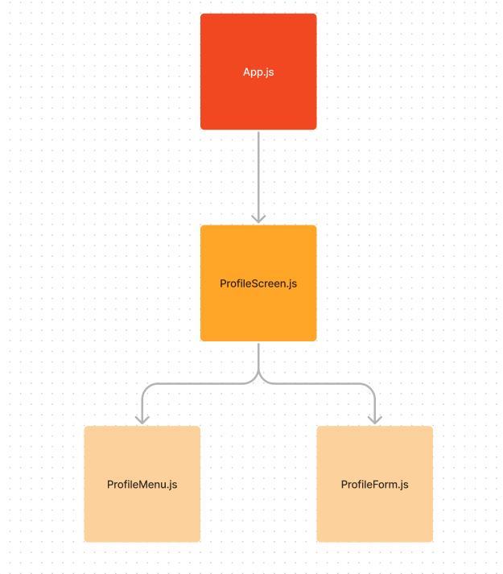

# Fluxo de Dados em React

## EXERCÍCIOS:

### Exercício 1

Vamos praticar uma análise mais crítica do aplicativo. 
Desenhe a estrutura da árvore de componentes desse template. Quais componentes existem e como está a descendência de cada um?

Aqui está um exemplo aleatório: 

#### Resposta:
Estrutura de árvore apresentada no Exercício

### Exercício 2

Garanta que a edição dos campos do formulário reflitam nos valores do menu do perfil (menu lateral esquerdo). 
Não se preocupe em implementar o uso do botão, faça tudo funcionar automaticamente por enquanto:
- digita no input, atualiza automaticamente o menu lateral

### Exercício 3

Agora que tudo está integrado, refatore e faça com que a atualização aconteça apenas quando o botão for clicado.

* Veja no exemplo abaixo o resultado final esperado:

https://github.com/labenuexercicios/fluxo-de-dados-no-react-exercicios/assets/71137294/5dabeac8-24a9-4202-a546-188ff62fd978

***

## TEMPLATES LABENU PARA PRATICAR NOVAMENTE
[Template Github](https://github.com/labenuexercicios/fluxo-de-dados-no-react-exercicios)

[Template Codesandbox](https://codesandbox.io/s/fluxo-de-dados-feedback-jtuj5e)
